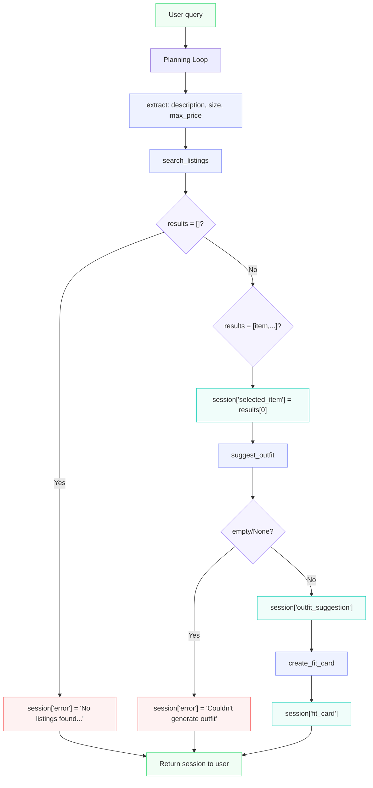

# FitFindr — planning.md

> Complete this document before writing any implementation code.
> Your spec and agent diagram are what you'll use to direct AI tools (Claude, Copilot, etc.) to generate your implementation — the more specific they are, the more useful the generated code will be.
> Your planning.md will be reviewed as part of your submission.
> Update it before starting any stretch features.

---

## Tools

List every tool your agent will use. For each tool, fill in all four fields.
You must have at least 3 tools. The three required tools are listed — add any additional tools below them.

### Tool 1: search_listings

**What it does:**

<!-- Describe what this tool does in 1–2 sentences -->

search_listings will take in a user query and filters the listings json database to find what matches the user query.

**Input parameters:**

<!-- List each parameter, its type, and what it represents -->

- `description` (str): a description of the piece of clothing or wardrobe item
- `size` (str): user size for the piece of item they requested
- `max_price` (float): the upper bound of what a user is willing to pay for the item

**What it returns:**

<!-- Describe the return value — what fields does a result contain? -->

Returns a list[dict] of all listings that match the user's request, sorted by relevance (highest keyword overlap first). FitFindr will pick the top result (index 0) and return the listing's title, price, platform, and condition.

**What happens if it fails or returns nothing:**

<!-- What should the agent do if no listings match? -->

It would explain why no listings came back. If there are no XS red jeans for example, agent would ask user to Try broadening your search by not including a color or simply stating there are no XS jeans. Or send an error message if you it's not identifiable what is missing.

---

### Tool 2: suggest_outfit

**What it does:**

<!-- Describe what this tool does in 1–2 sentences -->

It suggests an outfit to the user based off the user wardrobe and the item returned from search_listings, using the LLM to reason about style combinations.

**Input parameters:**

<!-- List each parameter, its type, and what it represents -->

- `new_item` (dict): full listing dict returned from search_listings, contains fields like title, category, colors, style_tags
- `wardrobe` (dict): user's wardrobe containing a list of items, each with name, category, colors, style_tags, and notes

**What it returns:**

<!-- Describe the return value -->

Returns a string that describes one or more outfit combinations featuring the new item, referencing specific pieces from the user's wardrobe.

**What happens if it fails or returns nothing:**

<!-- What should the agent do if the wardrobe is empty or no outfit can be suggested? -->

If wardrobe is empty, the agent will respond with  "Please add items to your wardrobe before requesting an outfit suggestion." If no outfit is suggested, agent should simply respond "We couldn't generate an outfit suggestion right now. Please try again."

---

### Tool 3: create_fit_card

**What it does:**

<!-- Describe what this tool does in 1–2 sentences -->

Generates a short, shareable Instagram-style caption describing the complete outfit, featuring the new thrifted item.

**Input parameters:**

<!-- List each parameter, its type, and what it represents -->

- `outfit` (str): the outfit suggestion string returned from suggest_outfit
- `new_item` (dict): full listing dict from search_listings, contains fields
  like title, price, platform, colors, style_tags

**What it returns:**

<!-- Describe the return value -->

Returns a short string (2-3 sentences) written in a casual, social media tone
that highlights the new item, where it was thrifted, and how it fits into the
complete look.

**What happens if it fails or returns nothing:**

<!-- What should the agent do if the outfit data is incomplete? -->

If outfit is empty or None, return: "Can't create a fit card without an outfit
suggestion. Please try your search again." If the LLM returns an error,
return: "Couldn't generate a fit card right now. Please try again."

---

### Additional Tools (if any)

<!-- Copy the block above for any tools beyond the required three -->

---

## Planning Loop

**How does your agent decide which tool to call next?**

<!-- Describe the logic your planning loop uses. What does it look at? What conditions change its behavior? How does it know when it's done? -->

1. Parse the user query to extract `description` (str), `size` (str), `max_price` (float).
   Call `search_listings(description, size, max_price)` → store result in `session["results"]`

2. If `session["results"]` is empty:
   → set `session["error"] = "No listings found for your query. Try broadening your 
description, adjusting your size, or increasing your max price."`
   → return session early, do not proceed.

   If `session["results"]` is not empty:
   → set `session["selected_item"] = session["results"][0]`
   → proceed to step 3.

3. Call `suggest_outfit(session["selected_item"], wardrobe)` → store result in
   `session["outfit_suggestion"]`

   If `session["outfit_suggestion"]` is empty or None:
   → set `session["error"] = "Couldn't generate an outfit suggestion. Please try again."`
   → return session early, do not proceed.

   If `session["outfit_suggestion"]` is a non-empty string:
   → proceed to step 4.

4. Call `create_fit_card(session["outfit_suggestion"], session["selected_item"])`
   → store result in `session["fit_card"]`
   → return session. Agent is done.

---

## State Management

**How does information from one tool get passed to the next?**

<!-- Describe how your agent stores and accesses state within a session. What data is tracked? How is it passed between tool calls? -->

State is tracked in a `session` dictionary that is initialized at the start of each interaction and passed through the planning loop. Each tool writes its output to a specific key, which the next tool reads as input.

```python
session = {
    "selected_item": None,      # set by search_listings, passed into suggest_outfit
    "outfit_suggestion": None,  # set by suggest_outfit, passed into create_fit_card
    "fit_card": None,           # set by create_fit_card, returned to user
    "error": None               # set by any tool on failure, triggers early return
}
```

As the planning loop progresses, each key is populated in order. If any tool fails, `session["error"]` is set and the loop returns early without calling subsequent tools.


---

## Error Handling

For each tool, describe the specific failure mode you're handling and what the agent does in response.

| Tool            | Failure mode                          | Agent response |
| --------------- | ------------------------------------- | -------------- |
| search_listings | No results match the query            |    "No listings found for your query. Try broadening your 
description, adjusting your size, or increasing your max price.             |
| suggest_outfit  | Wardrobe is empty                     |    "Please add items to your wardrobe before requesting an outfit suggestion."              |
| create_fit_card | Outfit input is missing or incomplete |   "Can't create a fit card without an outfit
suggestion. Please try your search again."            |

---

## Architecture

<!-- Draw a diagram of your agent showing how the components connect:
     User input → Planning Loop → Tools (search_listings, suggest_outfit, create_fit_card)
                                                                          ↕
                                                                   State / Session
     Show what triggers each tool, how state flows between them, and where error paths branch off.
     ASCII art, a Mermaid diagram (https://mermaid.js.org/syntax/flowchart.html), or an embedded
     sketch are all fine. You'll share this diagram with an AI tool when asking it to implement
     the planning loop and each individual tool. -->

---


---

## AI Tool Plan

<!-- For each part of the implementation below, describe:
     - Which AI tool you plan to use (Claude, Copilot, ChatGPT, etc.)
     - What you'll give it as input (which sections of this planning.md, your agent diagram)
     - What you expect it to produce
     - How you'll verify the output matches your spec before moving on

     "I'll use AI to help me code" is not a plan.
     "I'll give Claude my Tool 1 spec (inputs, return value, failure mode) and ask it to implement
     search_listings() using load_listings() from the data loader — then test it against 3 queries
     before trusting it" is a plan. -->

**Milestone 3 — Individual tool implementations:**

I'll use Claude. I will provide the planning.md file and have it read my architecture diagram, Tools section, State Management, and Error Handling so it doesn't guess on inputs, return values, or failure responses. I'll give Claude one tool at a time — paste in that tool's spec block and ask it to implement the function in tools.py. Before moving to the next tool, I'll test it in the terminal with at least 3 queries covering the happy path and failure mode.

**Milestone 4 — Planning loop and state management:**

I'll use Claude. I will provide the Planning Loop section and Architecture diagram from planning.md so it has the exact conditional logic and session keys to work from. I expect it to produce the run_agent() function in agent.py. Before using it, I'll check that it branches on search_listings results, writes to the correct session keys, and returns early on failure — then test it with both a valid query and an impossible query to confirm both paths work.

---

## A Complete Interaction (Step by Step)

FitFindr is an app that helps users search for items at a thriftstore, and suggests outfits and creates a fit card as well. The trigger chain is user query --> search_listings; search_listings result --> triggers suggest_outfit; suggest_outfit result --> triggers create_fit_card. On a failure, the system will respond to the user with tips on how to improve their query, most likely to be descriptive and include any information that is not found (gender, size, interest in fashion, etc). If a tool "X" fails, the triggered tool "Y" will not be called.

Write out what a full user interaction looks like from start to finish — tool call by tool call. Use a specific example query.

**Example user query:** "I'm looking for a vintage graphic tee under $30. I mostly wear baggy jeans and chunky sneakers. What's out there and how would I style it?"

**Step 1:**

<!-- What does the agent do first? Which tool is called? With what input? -->

`search_listings(description="vintage graphic tee", size=None, max_price=30.0)` is called. It filters listings.json and returns a list of matching items. FitFindr takes the top result and stores it: `session["selected_item"] = results[0]` 
(e.g. "Faded Band Tee — $22, Depop, Good condition").

**Step 2:**

<!-- What happens next? What was returned from step 1? What tool is called now? -->

`suggest_outfit(new_item=session["selected_item"], wardrobe=get_example_wardrobe())` 
is called. The LLM reasons about the new item against the user's wardrobe and returns a styling suggestion. Stored as `session["outfit_suggestion"]`
(e.g. "Pair this with your baggy jeans and chunky sneakers for a 90s grunge look.").

**Step 3:**

<!-- Continue until the full interaction is complete -->

`create_fit_card(outfit=session["outfit_suggestion"], new_item=session["selected_item"])` is called. The LLM generates a short Instagram-style caption. Stored as 
`session["fit_card"]`.

**Final output to user:**

<!-- What does the user actually see at the end? -->

The user sees three things:
1. The top listing: "Faded Band Tee — $22, Depop, Good condition"
2. Outfit suggestion: "Pair this with your baggy jeans and chunky sneakers for a 90s grunge look."
3. Fit card: "thrifted this faded band tee off depop for $22 and it was made for my baggy jeans!"